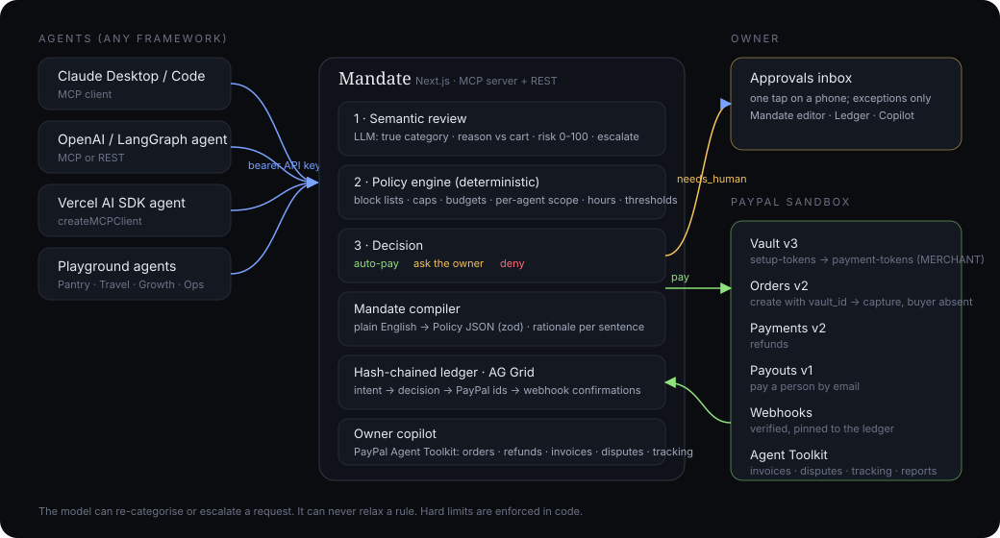

# Mandate

**A governed PayPal wallet for AI agents.** Write the rules in English; agents spend inside them.

Agents can already shop. Nobody will hand them the card. Mandate sits between a person's PayPal wallet and any number of AI agents: the owner writes a spending mandate in plain English, Claude/Gemini compiles it into an enforceable policy, agents request purchases over MCP or REST, and Mandate decides in seconds: **pay** (PayPal Orders against a vaulted wallet, buyer absent), **ask** (one-tap owner approval), or **deny**. Every step lands in a hash-chained ledger next to PayPal's own capture, payout, refund and webhook identifiers.

Built for the PayPal AI Hackathon 2026 on the PayPal **sandbox**.

**Live demo:** https://mandate-taupe.vercel.app · **Video:** see Devpost · **Repo:** https://github.com/raunitgrey7/mandate

<p align="center"></p>

## What it does

| Owner side | Agent side |
| --- | --- |
| **Mandate editor**: prose in, policy out. The AI compiler explains how it read every sentence; hard numbers and block lists become code-enforced rules. | **MCP server** at `/api/mcp` (Streamable HTTP, bearer API key per agent). Tools: `get_mandate`, `request_purchase`, `request_payout`, `get_request_status`, `list_my_requests`. |
| **Wallet**: link PayPal once via Vault v3 (`usage_type: MERCHANT`), or vault a card server-side. Agents never see the token, only an API key to Mandate. | **REST** mirror at `/api/v1/intents` for agents that speak HTTP. |
| **Approvals inbox**: exceptions only. Approving pays immediately through PayPal. Works on a phone. | **Playground**: four real LLM agents (Pantry, Travel, Growth, Ops) running the exact same tools, streamed live. |
| **Ledger** (AG Grid): every request, decision, risk score and PayPal id; CSV export; SHA-256 hash chain with on-page verification. | **Payouts**: agents can pay people (a dog walker, a contractor) via PayPal Payouts when the mandate allows. |
| **Copilot**: chat over the PayPal account using the official **PayPal Agent Toolkit** (orders, refunds, invoices, disputes, tracking, subscriptions, transaction search) plus Mandate actions (approve, deny, refund). | **Receipts**: each paid request carries the PayPal order, capture or payout batch id, and webhook confirmations are pinned to the same chain. |

### The decision pipeline

```
agent request
   │
   ├─ 1. Semantic review (LLM)      what is really being bought? does the reason fit?
   │      → normalised category, risk 0-100, flags, escalate?
   │
   ├─ 2. Deterministic policy engine (code, never the model)
   │      block/allow lists · per-agent scope · hard caps (deny)
   │      approval threshold · rolling budgets · hours · new merchant (escalate)
   │
   └─ 3. Outcome
          auto_approved → PayPal Orders v2 with payment_source.paypal.vault_id → captured
          needs_human   → owner inbox → approve → same PayPal path
          denied        → logged, nothing moves
```

The model can only re-categorise or escalate. It can never relax a rule, and hard limits are enforced by code. That is the trust property the whole product rests on.

## PayPal integration (sandbox)

| Capability | Endpoint | Where |
| --- | --- | --- |
| Vault a PayPal wallet for buyer-absent charges | `POST /v3/vault/setup-tokens` (paypal, `usage_type: MERCHANT`) → owner approves → `POST /v3/vault/payment-tokens` | `src/lib/paypal/vault.ts` |
| Vault a card server-side (no login step) | `POST /v3/vault/setup-tokens` (card) → `POST /v3/vault/payment-tokens` | `src/lib/paypal/vault.ts`, `src/app/api/v1/wallet/card` |
| Agent-initiated purchase | `POST /v2/checkout/orders` with `payment_source.paypal.vault_id` or `payment_source.card.vault_id`, `POST .../capture` | `src/lib/paypal/orders.ts` |
| Refund | `POST /v2/payments/captures/{id}/refund` | `src/lib/paypal/orders.ts` |
| Pay a person | `POST /v1/payments/payouts` | `src/lib/paypal/payouts.ts` |
| Webhooks with signature verification | `POST /v1/notifications/verify-webhook-signature` | `src/app/api/webhooks/paypal/route.ts` |
| Owner copilot over the whole account | **PayPal Agent Toolkit** (`@paypal/agent-toolkit/ai-sdk`) | `src/lib/copilot-tools.ts` |

## AI integration

* **Vercel AI SDK** (`ai` v7) for structured output, tool calling and streaming.
* **Model**: any provider; the demo uses Gemini 3.8 Flash. Set `ANTHROPIC_API_KEY`, `GOOGLE_GENERATIVE_AI_API_KEY` or `AI_GATEWAY_API_KEY`.
* Three LLM roles: the **mandate compiler** (`src/lib/policy/compile.ts`), the **intent reviewer** (`src/lib/policy/review.ts`) and the **playground agents** (`src/lib/playground.ts`). A rule-based fallback keeps the product usable with no key, with reduced nuance.
* **MCP**: Mandate is itself an MCP server (`mcp-handler` + `@modelcontextprotocol/server`), so Claude Desktop, Cursor, Claude Code or an AI SDK agent can hold a governed wallet.

## Run it

Requirements: Node 20+, a PayPal sandbox REST app, and one AI provider key.

```bash
git clone https://github.com/raunitgrey7/mandate && cd mandate
npm install
cp .env.example .env.local      # fill PAYPAL_CLIENT_ID, PAYPAL_CLIENT_SECRET and one AI key
npm run dev                     # http://localhost:3000
```

No database setup is needed: with `DATABASE_URL` empty the app runs embedded Postgres (PGlite) under `./.data`. Set a Postgres URL (Neon) for hosted deployments.

### PayPal sandbox setup (5 minutes)

1. [developer.paypal.com](https://developer.paypal.com/dashboard/) → Testing Tools → Sandbox Accounts → create a **US Business** and a **US Personal** account.
2. Apps & Credentials → Create App on the US business account. Under Features enable **Save payment methods (Vault)**, **Payouts**, **Invoicing**, **Transaction search**. Copy the client id and secret into `.env.local`.
3. Start the app and open **Wallet**. Either **Link with PayPal** (log in as the US *personal* sandbox account; its password is under the account's View/Edit menu) or **Save a card** with the prefilled PayPal sandbox test card `4111 1111 1111 1111`. No login is needed for the card path.
4. Optional: `npm run webhook:register https://your-host` and put the printed id in `PAYPAL_WEBHOOK_ID`.

### Try the flow

1. **Playground → Run selected agents.** Pantry pays groceries instantly, Travel waits for you, Growth is denied for relabelling whisky as groceries, Ops pays the dog walker via Payouts.
2. **Approvals**: approve the train ticket; the capture id appears in seconds.
3. **Ledger**: filter, group, export; the chain badge verifies the audit trail.
4. **Copilot**: "Refund the most recent grocery purchase" or "List the last five transactions".
5. **Agents**: copy the MCP snippet into Claude Desktop or Claude Code and let your own agent ask for money.

Connect an external agent:

```bash
claude mcp add --transport http mandate https://<host>/api/mcp --header "Authorization: Bearer <agent key>"
```

## Project layout

```
src/lib/policy/     schema.ts (policy), compile.ts (prose → policy), engine.ts (rules), review.ts (LLM review)
src/lib/paypal/     client.ts, vault.ts, orders.ts, payouts.ts, webhooks.ts
src/lib/intents.ts  the request lifecycle: review → engine → execute via PayPal → ledger
src/lib/ledger.ts   hash-chained audit log with verification
src/lib/agent-tools.ts  the one tool surface shared by MCP, REST and the playground
src/app/api/mcp     MCP server · src/app/api/v1/* REST · src/app/api/webhooks/paypal
src/app/*           Overview, Approvals, Mandate, Agents, Playground, Ledger, Copilot, Wallet
```

## Tools used

PayPal REST APIs (Vault v3, Orders v2, Payments v2, Payouts v1, Webhooks), PayPal Agent Toolkit, Vercel AI SDK, Gemini / Claude, Model Context Protocol (`mcp-handler`), Next.js 16, Drizzle ORM with Neon Postgres (hosted) or PGlite (local), AG Grid, Vercel.

## License

MIT. See [LICENSE](LICENSE).
